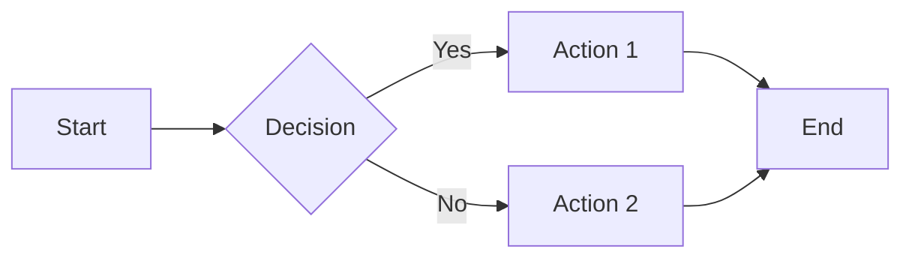

# Markdown Features Showcase

Markdown is a lightweight markup language that you can use to add formatting elements to plaintext text. Here's a demonstration of its features:

## 1. Headings

You can create headings by using `#` symbols. The number of `#` determines the heading level:

# Heading 1
## Heading 2
### Heading 3
#### Heading 4
##### Heading 5
###### Heading 6

---

## 2. Text Formatting

- **Bold**: Use `**bold**` or `__bold__` → **bold**
- *Italic*: Use `*italic*` or `_italic_` → *italic*
- ***Bold and italic***: Use `***bold and italic***` → ***bold and italic***
- ~~Strikethrough~~: Use `~~strikethrough~~` → ~~strikethrough~~

---

## 3. Lists

### Unordered List:
- Item 1
- Item 2
  - Sub-item 2.1
  - Sub-item 2.2

### Ordered List:
1. First
2. Second
3. Third
   1. Sub-item 3.1
   2. Sub-item 3.2

---

## 4. Links and Images

- [Link to Google](https://www.google.com)
- 

---

## 5. Code

Inline `code` looks like this.

Block code (with language specified for syntax highlighting):

```python
def hello_world():
    print("Hello, world!")
```


